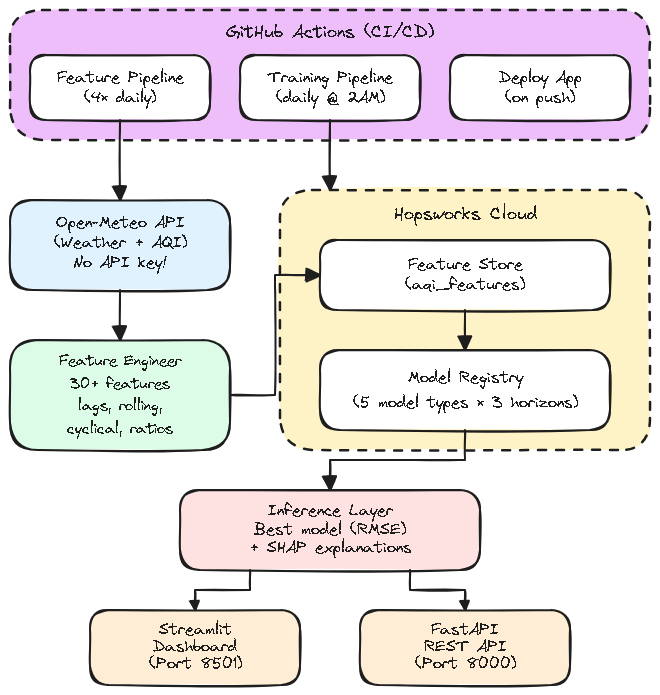

# 🌬️ Pearls AQI Predictor

> **Production-grade Air Quality Index forecasting with MLOps** — built during a 10Pearls internship program.

[](https://github.com/mansoor02-dev/pearls-aqi-predictor/actions/workflows/feature_pipeline.yml)
[](https://github.com/mansoor02-dev/pearls-aqi-predictor/actions/workflows/training_pipeline.yml)
[](https://github.com/mansoor02-dev/pearls-aqi-predictor/actions/workflows/app_deply.yml)

---

## 📖 Overview

**Pearls AQI Predictor** is an end-to-end Machine Learning system that forecasts the **European Air Quality Index (AQI)** for **Lahore, Pakistan** up to **3 days ahead** (1d, 2d, and 3d forecast horizons). The system adheres to production MLOps standards — leveraging automated data pipelines, a centralized feature store, a model registry with dynamic promotion, and a real-time interactive web dashboard.

### Why This Matters
Lahore consistently ranks among the most polluted cities globally. Accurate AQI forecasts enable residents to plan outdoor activities safely, empower local authorities to issue timely health advisories, and provide researchers with a fully open, reproducible MLOps reference implementation for environmental forecasting.

---

## 🏗️ System Architecture


---

## 📚 Documentation & Technical Deliverables

For an in-depth exploration of the project's technical methodology, mathematical formulations, and model evaluations, check the documentation:

- 📄 **[Final Report](./docs/report.md)** — In-depth technical documentation, experimental evaluation, and architectural analysis.
- 📊 **[Presentation Slides](./docs/presentation.md)** — Executive summary and architectural slides.

---

## 🌟 Key Features

### 🔄 1. Automated Feature Pipeline
- **Data Source**: Fetches hourly weather parameters (temperature, humidity, wind vector components, rain) and atmospheric pollutants ($\text{PM}_{2.5}$, $\text{PM}_{10}$, $\text{NO}_2$, $\text{O}_3$, $\text{CO}$, $\text{SO}_2$) from the [Open-Meteo API](https://open-meteo.com) without API key restrictions.
- **30+ Engineered Features**:
  - **Temporal Encodings**: Cyclical sine/cosine transformations for hour-of-day, day-of-week, and month.
  - **Lagged Signals**: AQI values lagged at 1h, 3h, 6h, 12h, and 24h intervals.
  - **Rolling Statistics**: 4h, 6h, 12h, and 24h rolling moving averages + exponential weighted moving averages ($\text{EWMA}$).
  - **Derived Environmental Factors**: Wind vector components ($u/v$), $\text{PM}_{2.5}/\text{PM}_{10}$ ratio, $\text{NO}_2/\text{O}_3$ interaction ratio, 7-day temperature trends, and cumulative rain volume.
- **Storage**: Ingests features directly into the **Hopsworks Feature Store**.
- **Automation**: Executed **4× daily** (`00:00`, `06:00`, `12:00`, `18:00` UTC) via GitHub Actions workflows.

### 🤖 2. Retraining & Model Registry Pipeline
- **Dynamic Data Retrieval**: Pulls recent historical features directly from Hopsworks.
- **Multi-Model Evaluation Suite**: Trains 5 candidate architectures across each target forecast horizon (1d, 2d, 3d):
  | Model | Category | Key Configuration / Hyperparameters |
  |-------|----------|-------------------------------------|
  | **Ridge Regression** | Linear Model | `alpha=0.1`, `RobustScaler` preprocessing |
  | **Random Forest** | Ensemble Tree | 200 estimators, `max_depth=15`, `min_samples_split=5` |
  | **XGBoost** | Gradient Boosted Trees | 1000 estimators, `learning_rate=0.03`, `max_depth=4` |
  | **Feed-Forward NN (FFN)** | Deep Learning | 2 hidden layers (64/32 nodes), ReLU, Dropout (0.3) |
  | **LSTM** | Sequence Model | 24-step historical lookback, 64 hidden units |
- **Model Promotion**: Evaluates models using $\text{RMSE}$, $\text{MAE}$, $R^2$, and **Skill vs. Naïve Persistence Baseline**. Automatically selects and promotes the top-performing model to the **Hopsworks Model Registry**.
- **Model-as-Bundle Architecture**: Bundles model weights (`.joblib` / `.pt`) alongside generated **SHAP explainability plots** (`shap_summary.png`) within the Model Registry artifact, eliminating fragile Git-based artifact tracking.

### 📈 3. Interactive Web Dashboard (Streamlit)
- **Real-Time AQI Status**: Color-coded European AQI indicator gauge.
- **Pollutant Breakdown Grid**: Real-time metric cards for $\text{PM}_{2.5}$, $\text{PM}_{10}$, $\text{NO}_2$, $\text{O}_3$, $\text{CO}$, $\text{SO}_2$, UV Index, and Temperature.
- **Multi-Horizon Forecasts**: Interactive Plotly timeline charts showing predicted AQI along with 95% confidence intervals derived from production validation error metrics.
- **Native SHAP Explainability**: Embedded SHAP feature importance charts loaded dynamically from the production model artifact.

### 🔌 4. Production REST API (FastAPI)
- `GET /health`: Liveness probe for CI/CD and deployment monitoring.
- `POST /predict`: Evaluates incoming requests for target cities, fetches features, and returns $N$-day AQI forecasts with confidence bounds and model provenance.

---

## 📁 Repository Structure

```text
pearls-aqi-predictor/
├── app/
│   ├── dashboard.py            # Streamlit web application & UI
│   └── api.py                  # FastAPI REST endpoints
├── config/
│   └── settings.py             # Pydantic environment configuration
├── src/
│   ├── data/
│   │   ├── api_client.py       # Open-Meteo API integration
│   │   └── data_validator.py   # Schema validation & drift testing
│   ├── features/
│   │   ├── feature_engineering.py  # 30+ feature transformation functions
│   │   ├── feature_store.py        # Hopsworks Feature Store wrapper
│   │   └── backfill.py             # Historical data backfill orchestrator
│   ├── models/
│   │   ├── base_model.py       # Abstract Base Model class
│   │   ├── sklearn_models.py   # Ridge, Random Forest, XGBoost wrappers
│   │   ├── deep_learning.py    # PyTorch FFN and LSTM models
│   │   ├── model_registry.py   # Hopsworks Model Registry manager
│   │   └── evaluate.py         # Evaluation metrics & Skill scoring
│   ├── monitoring/
│   │   ├── drift_detector.py   # Evident AI statistical drift monitoring
│   │   └── alerts.py           # Multi-channel notification dispatchers
│   ├── pipeline/
│   │   ├── feature_pipeline.py  # Feature ingestion pipeline runner
│   │   └── training_pipeline.py # Training & model promotion pipeline runner
│   └── inference.py            # Model resolution & prediction engine
├── scripts/
│   ├── run_backfill.py         # Data backfill execution script
│   ├── run_feature_pipeline.py # Feature ingestion execution script
│   └── run_training_pipeline.py# Model training execution script
├── docs/
│   ├── report.md               # Technical report
│   └── presentation.md         # Slide deck markdown
├── .github/workflows/
│   ├── feature_pipeline.yml    # Ingestion workflow (4x daily)
│   ├── training_pipeline.yml   # Training workflow (daily)
│   └── app_deply.yml           # Application deploy & API test workflow
├── tests/                      # Pytest unit & integration tests
├── Makefile                    # Developer CLI command shortcuts
├── pyproject.toml              # Project dependencies (managed via uv)
└── README.md                   # Project documentation
```

---

## ⚡ Quick Start

### Prerequisites
- **Python 3.12+**
- **[uv](https://docs.astral.sh/uv/)** (recommended high-performance package manager)
- **Hopsworks Account** ([Free Tier Account](https://app.hopsworks.ai/))

### 1. Clone & Install Dependencies

```bash
git clone https://github.com/mansoor02-dev/pearls-aqi-predictor.git
cd pearls-aqi-predictor

# Install dependencies using uv or make
make install   # or: uv sync
```

### 2. Set Up Environment Variables

Create a `.env` file in the root directory:
```bash
cp .env.example .env
```

Configure your Hopsworks credentials:
```env
HOPSWORKS_API_KEY=your_api_key_here
HOPSWORKS_PROJECT_NAME=pearl_aqi_feature_store
HOPSWORKS_HOST=c.app.hopsworks.ai
CITY=Lahore
FORECAST_HORIZON=3
```

### 3. Run Pipelines (Local Execution)

```bash
# Backfill historical features (for initial setup)
make run-backfill   # or: uv run python scripts/run_backfill.py

# Ingest current weather & pollutant features into Hopsworks
make run-feature    # or: uv run python scripts/run_feature_pipeline.py

# Train models, evaluate performance, and promote to Model Registry
make run-train      # or: uv run python scripts/run_training_pipeline.py
```

### 4. Launch Applications

#### Streamlit Dashboard:
```bash
make run-app        # or: uv run streamlit run app/dashboard.py
```
Open your browser at `http://localhost:8501`.

#### FastAPI REST Server:
```bash
make run-api        # or: uv run uvicorn app.api:app --reload --port 8000
```
API Documentation will be available at `http://localhost:8000/docs`.

---

## 🧪 Testing & Code Quality

Run the test suite, linter, and formatters via the Makefile:

```bash
# Run pytest test suite
make test           # or: uv run pytest -v

# Run linting checks (flake8 & mypy)
make lint

# Auto-format codebase (black & isort)
make format
```

---

## 🛠️ Technology Stack

| Domain | Technology | Purpose |
|--------|------------|---------|
| **Core Language** | Python 3.12 | Primary development language |
| **Package Management** | `uv` (Astral) | Fast dependency resolution & virtualenv management |
| **Machine Learning** | `scikit-learn`, `XGBoost`, `PyTorch` | Classical & Deep Learning algorithms |
| **Explainability** | `SHAP` | Interpretability plots for feature importance |
| **Feature Store** | Hopsworks | Feature storage and point-in-time retrieval |
| **Model Registry** | Hopsworks | Versioned model artifact storage & metadata tracking |
| **Dashboard** | Streamlit, Plotly | Interactive web app & custom charts |
| **REST API** | FastAPI, Uvicorn | High-performance async prediction server |
| **Automation & CI/CD** | GitHub Actions | Scheduled feature & model pipeline workflows |
| **Data Provider** | Open-Meteo API | Weather & atmospheric pollution data |

---

## 📄 License

This repository was created as part of an official internship project at **10Pearls**.
