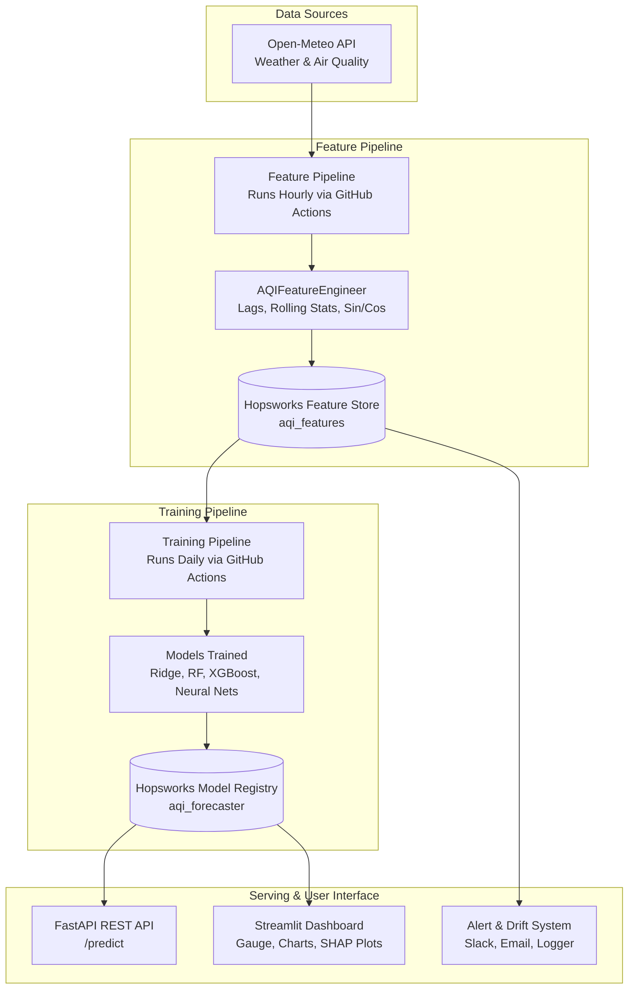

# System Architecture — Pearls AQI Predictor

The system is a 100% serverless, feature-store-first machine learning pipeline for forecasting Air Quality Index (AQI) up to 3 days ahead.

## High-Level Overview

## Key Components

1. **Feature Pipeline**: Runs hourly on GitHub Actions. It fetches live pollutant and weather data from Open-Meteo, validates the schema, computes time/lag/rolling features, and saves them into the **Hopsworks Feature Store**.
2. **Training Pipeline**: Runs daily. It downloads historical features from Hopsworks, trains 5 ML model architectures (Ridge, Random Forest, XGBoost, FFN, LSTM), evaluates performance against a baseline, and registers the best model into the **Hopsworks Model Registry**.
3. **Inference & Serving**: FastAPI and Streamlit fetch the `production`-tagged model from Hopsworks to serve 1-day, 2-day, and 3-day AQI forecasts.
4. **Monitoring & Alerting**: Tracks feature drift with Evidently AI and sends alert notifications via Slack, Email, or Logs when AQI > 150.
